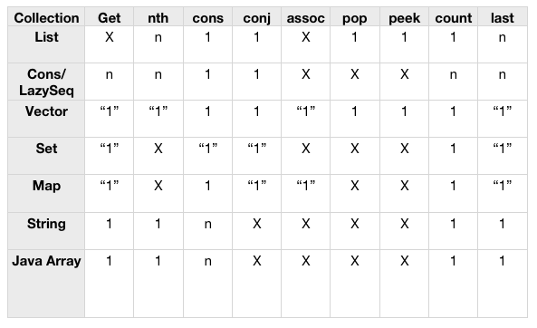

# Collections

'Collections', here, is a set of data types that let us collect collections and primitive values.

All Clojure collections share a set of properties:

- Like primitives, they are immutable
- They are persistent - 'modifications' preserve previous copies

Clojure utilises 'structural sharing' to lower memory overhead here. After modifying a data structure, the old and new copy will share references for unchanged properties.

Modifications to collections often yield different types of collections. 

## Common supported functions

All collections support:

- `(count coll)` for the size of the collection
- `(conj coll el)` to add to the collection - but the kind of addition differs for each collection type
- `(seq col)` to get a sequence from the collection. All sequence functions can also be called directly on all collections, without needing to first call `seq`.

## Performance

